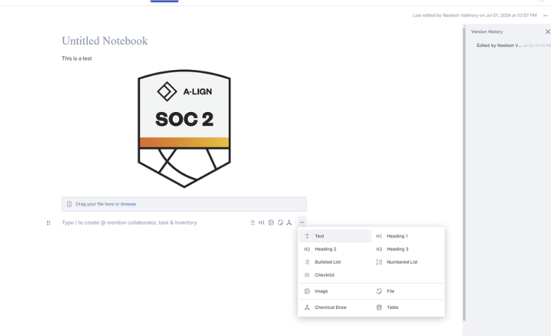
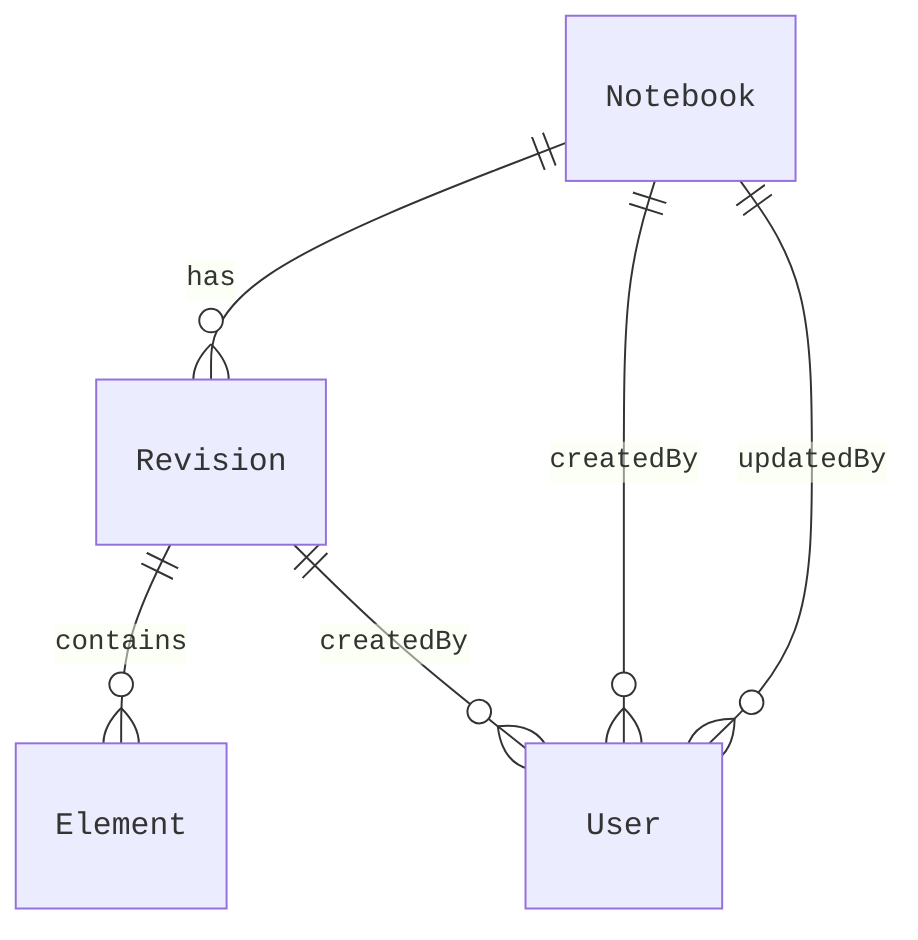

# Albert Notebook

- [Instructions](#instructions)
  - [Abstract](#abstract)
  - [Exercise (45 Min)](#exercise-45-min)
- [Design](#design)
  - [Access Patterns](#access-patterns)
  - [Future Access Patterns](#future-access-patterns)
  - [Entities](#entities)
  - [API](#api)
  - [Persistence](#persistence)
    - [Single-Table Design](#single-table-design)
    - [Composite Primary Key (Partition Key + Sort Key)](#composite-primary-key-partition-key--sort-key)
      - [Partition Key: `notebookId`](#partition-key-notebookid)
      - [Sort Key: `selection`](#sort-key-selection)
    - [Facets](#facets)
      - [Notebook Metadata](#notebook-metadata)
      - [Revision Metadata](#revision-metadata)
      - [Element](#element)
    - [Indexes](#indexes)
      - [LSIs](#lsis)
      - [GSIs](#gsis)
    - [Optimization Considerations](#optimization-considerations)
  - [References](#references)

## Instructions

### Abstract

Albert Notebook enables users to create free-flow content using various notebook components, including text, images, chemical drawings, mentions, and files, with plans to support Albert entities in the future. The notebook also supports content reordering and maintains a version history.



### Exercise (45 Min)

Design a backend for the Notebook (API and database schema) to implement the specified functionality. Utilize OpenAPI 3.0 to define all REST endpoints. Use DynamoDB with a single table design to store and retrieve transactional data. The API should be optimized for patching the notebook, retrieving version history, and reordering notebook content.

## Design

### Access Patterns

The primary access patterns as defined by the requirements:

| Access Pattern                                                                                                                         | Operation | Key Attributes           | API Endpoint                                            |
| -------------------------------------------------------------------------------------------------------------------------------------- | :-------: | ------------------------ | ------------------------------------------------------- |
| **Patching the notebook**<br />_For a given notebook, create a new revision based on the previous with the specified partial changes._ | `PutItem` | `notebookId`             | `PATCH /notebook/:id`<br>`POST /notebook/:id/revisions` |
| **Retrieving version history**<br />_For a given notebook, fetch a list of revisions._                                                 |  `Query`  | `notebookId`, `revision` | `GET   /notebook/:id/revisions`                         |
| **Reorder notebook content**<br />_For a given notebook, create a new revision based on the previous, with its content reordered._     | `PutItem` | `notebookId`             | `POST  /notebook/:id/revisions`                         |

### Future Access Patterns

Additional access patterns that may be required in the future:

| Access Pattern                                                                                  | Operation | Key Attributes | API Endpoint                                      |
| ----------------------------------------------------------------------------------------------- | :-------: | -------------- | ------------------------------------------------- |
| **Creating a new notebook**<br />_Create a new notebook with an initial revision._              | `PutItem` | `notebookId`   | `POST /notebooks`                                 |
| **Retrieving the latest version**<br />_For a given notebook, fetch the latest revision._       |  `Query`  | `notebookId`   | `GET  /notebook/:id`                              |
| **Retrieving a specific version**<br />_For a given notebook, fetch a specific revision._       |  `Query`  | `notebookId`   | `GET  /notebook/:id/revisions/:revisionId`        |
| **Reverting to a specific version**<br />_For a given notebook, revert to a specific revision._ | `PutItem` | `notebookId`   | `POST /notebook/:id/revisions/:revisionId/revert` |
| **Deleting a notebook**<br />_Delete a notebook and all its revisions._                         | `Delete`  | `notebookId`   | `DELETE /notebook/:id`                            |

### Entities

The core entities involved in the previously identified access patterns:

<table><tr><th>Entity Relationship</th><th>Schemas</th></tr><tr><td>



</td><td>

```typescript
type Notebook = {
  id: UUID;
  title: string;
  revisions: Revision[];
  createdAt: DateTime;
  createdBy: User;
  updatedAt: DateTime;
  updatedBy: User;
};

type Revision = {
  id: UUID;
  elements: Element[];
  createdAt: DateTime;
  createdBy: User;
};

type Element = {
  id: UUID;
  type: string;
  order: number;
  value: string | Record<string, unknown>;
};

type User = {
  id: UUID;
  name: string;
};
```

</td></tr></table>

### API

The API endpoints required to support the identified access patterns:

<!-- @todo -->

### Persistence

Notebooks can be persisted using a single-table design in DynamoDB. Any given
notebook would have a minimum of three items (one for each facet noted below):

- one capturing the unversioned notebook metadata
- one for each revision, capturing revision specific metadata
- one for each element within a revision

#### Single-Table Design

<table>
  <tr>
    <th colspan="2" style="text-align: center">Primary Key</th>
    <th colspan="5" style="text-align: center">Attributes</th>
  </tr>
  <tr>
    <th>PK: notebookId</th>
    <th>SK: selection</th>
    <th>type</th>
    <th>title</th>
    <th>latest</th>
    <th>revision</th>
    <th>element</th>
  </tr>
  <tr>
    <td rowspan="3">49f7335c-d7a8-4f1c-b2cc-...</td>
    <td>METADATA</td>
    <td>notebook</td>
    <td>My Notebook</td>
    <td>1</td>
    <td></td>
    <td></td>
  </tr>
  <tr>
    <td>v000001#METADATA</td>
    <td>revision</td>
    <td></td>
    <td></td>
    <td>1</td>
    <td></td>
  </tr>
  <tr>
    <td>v000001#000001</td>
    <td>element</td>
    <td></td>
    <td></td>
    <td></td>
    <td>

`{...}`

</td>
  </tr>
  <tr>
    <td rowspan="5">49f7335c-d7a8-4f1c-b2cc-...</td>
    <td>METADATA</td>
    <td>notebook</td>
    <td>Another Notebook</td>
    <td>8</td>
    <td></td>
    <td></td>
  </tr>
  <tr>
    <td>v000001#METADATA</td>
    <td>revision</td>
    <td></td>
    <td></td>
    <td>1</td>
    <td></td>
  </tr>
  <tr>
    <td>v000001#000001</td>
    <td>element</td>
    <td></td>
    <td></td>
    <td></td>
    <td>

`{...}`

</td>
  </tr>
  <tr>
    <td colspan="6" style="text-align: center">...</td>
  </tr>
  <tr>
    <td>v000008#000032</td>
    <td>element</td>
    <td></td>
    <td></td>
    <td></td>
    <td>

`{...}`

</td>
  </tr>
</table>

#### Composite Primary Key (Partition Key + Sort Key)

##### Partition Key: `notebookId`

The `notebookId` can serve as the partition key with a reasonably high
cardinality while still providing a logical collection of the notebook's
contents.

##### Sort Key: `selection`

For the sort key, a combination of the `revision` number and the element `order`
number can be used.

This will allow for efficient querying of the notebook's
revisions and elements. It will also allow us to store multiple _facets_ or item
types within the same table using special keywords such as `METADATA` when
outside the context of a specific revision or element.

> _**Note:** Because the sort key will be a string containing the composite of
> two numbers, sorting will be lexicographical rather than numerical. To restore
> numerical sorting, the numbers can be zero-padded to a fixed length._

#### Facets

While a typical single table design would lead to a fully denormalized
structure, it is possible to normalize the data to some extent. The lack of a
strict schema outside the primary key attributes means we can store multiple
item types within the same table.

The table will consist of three different _facets_ or item types:

##### Notebook Metadata

Any unversioned metadata that applies to the entire notebook, such as the title
and modification fields.

<table><tr><th>Schema</th><th>Example</th></tr><tr><td>

```typescript
type NotebookItem = {
  notebookId: UUID;
  selection: string;
  type: "notebook";
  title: string;
  latest: number;
  createdAt: DateTime;
  createdBy: {
    id: UUID;
    name: string;
  };
  updatedAt: DateTime;
  updatedBy: {
    id: UUID;
    name: string;
  };
};
```

</td><td>

```json
{
  "notebookId": "3fb3cad6-5d1c-4ec8-9bfc-e8dcd6017741",
  "selection": "METADATA",
  "type": "notebook",
  "title": "My Notebook",
  "latest": 1,
  "createdAt": "2021-01-01T00:00:00Z",
  "createdBy": {
    "id": "c17214445723N8knra0ni9qxlittxjxzf",
    "name": "Alice Smith"
  },
  "updatedAt": "2024-07-20 17:06:25-07:00",
  "updatedBy": {
    "id": "fe9c478a-f7b7-4b71-91b8-4fe2a3810210",
    "name": "Bob Johnson"
  }
}
```

</td></tr></table>

##### Revision Metadata

Each revision will have its own metadata record, identified by the `revisionId`
the `METADATA` keyword in place of an element order number.

<table><tr><th>Schema</th><th>Example</th></tr><tr><td>

```typescript
type RevisionItem = {
  notebookId: UUID;
  selection: string;
  type: "revision";
  revision: number;
  createdAt: DateTime;
  createdBy: {
    id: UUID;
    name: string;
  };
};
```

</td><td>

```json
{
  "notebookId": "bd995cf2-6c8c-4c2f-99ab-4de5ba4e312e",
  "selection": "v000001#METADATA",
  "type": "revision",
  "revision": 1,
  "createdAt": "2024-07-20 17:06:25-07:00",
  "createdBy": {
    "id": "fe9c478a-f7b7-4b71-91b8-4fe2a3810210",
    "name": "Bob Johnson"
  }
}
```

</td></tr></table>

##### Element

Each element within a revision will have its own record, identified by the
`revision` number and the element `order` number.

<table><tr><th>Schema</th><th>Example</th></tr><tr><td>

```typescript
type ElementItem = {
  notebookId: UUID;
  selection: string;
  type: "element";
  element: {
    order: number;
    type: string;
    value: string | Record<string, unknown>;
  };
};
```

</td><td>

```json
{
  "notebookId": "3fb3cad6-5d1c-4ec8-9bfc-e8dcd6017741",
  "selection": "v000001#000001",
  "type": "element",
  "element": {
    "order": 1,
    "type": "text",
    "value": "Hello, World!"
  }
}
```

</td></tr></table>

#### Indexes

The primary key is sufficient to cover all the primary access patterns, so no
secondary indexes are required.

##### LSIs

For future access patterns, LSIs are to be considered as a last resort. While
they can be used to optimize certain queries, they come with additional
constraints to the indexed table and are less flexible than GSIs.

##### GSIs

Unlike LSIs, GSIs can be added to existing tables as new access patterns emerge.

#### Optimization Considerations

- GSI's add storage costs and increase write overhead/latency. For infrequent access patterns, consider just scanning the table.
- Use DynamoDB's built-in TTL feature to automatically delete old revisions can help manage storage costs.
- Optimize large attributes by grouping them into separapte rows/items so that small attribute updates do not require rewriting the entire item.

### References

- [Single-Table Design Patterns for NoSQL](https://www.alexdebrie.com/posts/dynamodb-single-table/)
- [DynamoDB Best Practices](https://docs.aws.amazon.com/amazondynamodb/latest/developerguide/best-practices.html)
- [DynamoDB TTL](https://docs.aws.amazon.com/amazondynamodb/latest/developerguide/TTL.html)
- [DynamoDB Pricing](https://aws.amazon.com/dynamodb/pricing/)
- [OpenAPI 3.0](https://swagger.io/specification/)
- [Mermaid](https://mermaid-js.github.io/mermaid/#/)
- [CUID](https://usecuid.org/)
- [NanoID](https://github.com/ai/nanoid)
- [DynamoDB Data Types](https://docs.aws.amazon.com/amazondynamodb/latest/developerguide/HowItWorks.NamingRulesDataTypes.html)
- [DynamoDB API Reference](https://docs.aws.amazon.com/amazondynamodb/latest/APIReference/Welcome.html)
- [DynamoDB Data Model](https://docs.aws.amazon.com/amazondynamodb/latest/developerguide/bp-modeling-nosql-B.html)
